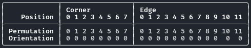
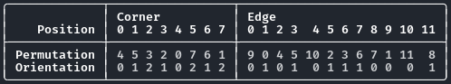
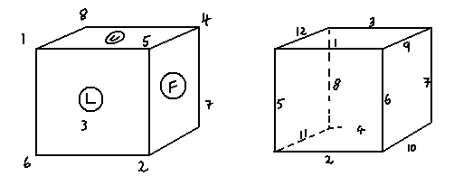
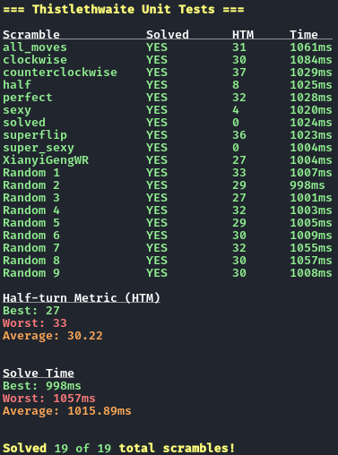

# Rubik's Cube Solver

An interactive Rubik's cube solver and visualization using Thistlethwaite's algorithm. This project can solve any randomly scrambled cube in approximately 1 second and about 31 turns.

## Turn Notation
All turns are made with respect to:
- White on U (Y+)
- Green on F (X-)
- Red on R (Z+)

This program supports the 18 standard cube face turns:
- Clockwise quarter turns (90&deg;):
    - R, U, F, L, D, B
- Counterclockwise quarter turns (90&deg;):
	- R', U', F', L', D', B'
- Half turns (180&deg;):
    - R2, U2, F2, L2, D2, B2

## Cube Representation
The cube can be represented with just 4 arrays, covering both permutation and orientation of corners and edges:
- **Corner Permutation:** An array of length 8 representing which corner piece is in each corner position.
- **Corner Orientation:** An array of length 8 representing the orientation of each corner piece (0, 1, or 2).
- **Edge Permutation:** An array of length 12 representing which edge piece is in each edge position.
- **Edge Orientation:** An array of length 12 representing the orientation of each edge piece (0 or 1).

Overall, there are only 20 cubelets (8 corners and 12 edges) that need to be tracked to fully represent the cube's state. Center pieces remain fixed relative to each other and do not need to be represented.

**Solved State:**\

**Scrambled State:**\

This image shows which cubelet position corresponds to which index in the permutation and orientation arrays.\
\
*https://www.jaapsch.net/puzzles/thistle.htm*

## Thistlethwaite's Algorithm
Thistlethwaite's algorithm solves the Rubik's cube in 4 phases, each with its own set of allowed turns and goals:
1. **Phase 1:** Reduce the cube to the subgroup where all edge pieces are correctly oriented.
    - Allowed Turns: $\langle L, R, F, B, U, D \rangle$
2. **Phase 2:** Reduce the cube to the subgroup where all M-slice edge pieces are in the M-slice and all corner pieces are correctly oriented.
    - Allowed Turns: $\langle L, R, F, B, U2, D2 \rangle$
3. **Phase 3:** Reduce the cube to the subgroup where all E/S-slice edge pieces are in the E/S-slices, all corners are in their correct tetrads, the edge parity is even, and the total twist of each tetrad is fixed.
    - Allowed Turns: $\langle L, R, F2, B2, U2, D2 \rangle$
4. **Phase 4:** Solve the cube completely.
    - Allowed Turns: $\langle L2, R2, F2, B2, U2, D2 \rangle$

## Building Tables
To implement this algorithm, we precompute lookup tables for each phase that map cube states to the minimum number of turns required to reach the goal state of that phase. During solving, we use these tables to guide a breadth-first search (BFS) through the allowed turns until we reach the goal state for each phase.

These tables can be large, so they are stored in binary files and loaded when the program starts. They can be regenerated using the provided scripts if needed.

The size and depth of each phase's table are as follows:
| Phase | Table Size       | Max Depth |
|-------|------------------|-----------|
| 1     | 2,048            | 7         |
| 2     | 1,082,565        | 10        |
| 3     | 29,400           | 13        |
| 4     | 663,552          | 15        |

The depth values indicate the maximum number of turns required to solve any cube state within that phase. So, the overall maximum number of turns to solve any cube using Thistlethwaite's algorithm is 7 + 10 + 13 + 15 = 45 turns.

## Unit Tests
The project includes unit tests to verify the correctness of cube operations and the solving algorithm. These tests can be run using the provided test suite.

10 example scrambles are included in the `Tests/Scrambles` directory, and another 9 random scrambles are generated during testing to ensure robustness.

The number of turns taken and the time taken to solve each scramble are printed during testing.

## References
https://en.wikipedia.org/wiki/Optimal_solutions_for_the_Rubik%27s_Cube
- Overview of Rubik's cube solving algorithms and optimal solutions.

https://www.jaapsch.net/puzzles/thistle.htm
- Explanation of Thistlethwaite's algorithm and cube representation.

https://puzzling.stackexchange.com/a/101271 \
https://puzzling.stackexchange.com/a/109429 \
https://tomas.rokicki.com/cubecontest/jaap.txt
- Additional insight into tetrad twists in Thistlethwaite's algorithm and how they are calculated.
